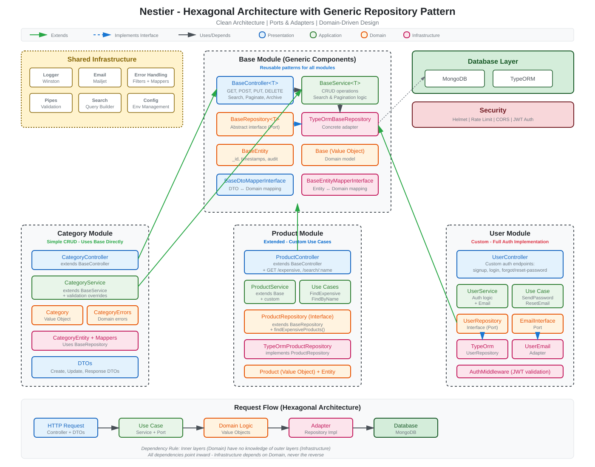

<div align="center">
  
  <h1>Nestier</h1>
  <p>
    <strong>A production-ready NestJS boilerplate with Hexagonal Architecture and Generic Repository Pattern</strong>
  </p>
  
  <p>
    <a href="https://github.com/BrahimAbdelli/nestier/blob/main/LICENSE"></a>
    <a href="https://nodejs.org"></a>
    <a href="https://www.typescriptlang.org/"></a>
    <a href="https://nestjs.com/"></a>
    
  </p>
</div>

---

## What is this?

Nestier is a boilerplate that demonstrates how to build scalable NestJS applications using **hexagonal architecture** (ports & adapters) and the **generic repository pattern**. It provides a solid foundation for enterprise applications with three example modules showcasing different implementation approaches:

| Module | Pattern | Description |
|--------|---------|-------------|
| **Category** | Base Implementation | Uses the generic base components directly for simple CRUD |
| **Product** | Extended Base | Extends base with custom use cases and repository methods |
| **User** | Custom Implementation | Full custom implementation with JWT authentication and email features |

## Quick Start

```bash
# Install dependencies
npm install

# Set up environment
cp .env.example .env

# Run the app
npm run start:dev
```

The API will be available at `http://localhost:3000/api` and Swagger docs at `http://localhost:3000/docs`.

## Architecture

The project follows a strict **hexagonal architecture** (also known as ports & adapters) with four distinct layers:

<div align="center">
  
</div>

### Layer Responsibilities

| Layer | Purpose | Contents |
|-------|---------|----------|
| **Domain** | Business logic & rules | Entities, Value Objects, Repository Interfaces, Domain Errors |
| **Application** | Use cases & orchestration | Services, Use Cases, Port Interfaces |
| **Infrastructure** | External concerns | TypeORM Repositories, Entity Mappers, Adapters, Middleware |
| **Presentation** | HTTP interface | Controllers, DTOs, DTO Mappers, Validation |

### Generic Base Pattern

The base module provides reusable generic components that other modules can extend:

```
BaseController<T>     →  CRUD endpoints + search + pagination
BaseService<T>        →  Business logic for all CRUD operations
BaseRepository<T>     →  Abstract repository interface (port)
TypeOrmBaseRepository →  Concrete TypeORM implementation (adapter)
BaseEntity            →  Common entity fields (id, timestamps)
```

## Project Structure

```
src/
├── main.ts                      # Application entry point
├── app.module.ts                # Root module configuration
├── app.initializer.ts           # Swagger, security, global pipes setup
│
├── modules/
│   ├── base/                    # Generic base module
│   │   ├── application/
│   │   │   ├── ports/           # Service & controller interfaces
│   │   │   └── services/        # BaseService<T> implementation
│   │   ├── domain/
│   │   │   ├── entities/        # BaseEntity
│   │   │   ├── repositories/    # BaseRepository interface (port)
│   │   │   └── value-objects/   # Base domain model
│   │   ├── infrastructure/
│   │   │   └── adapters/        # TypeOrmBaseRepository (adapter)
│   │   ├── presentation/
│   │   │   ├── controllers/     # BaseController factory function
│   │   │   └── dtos/            # BaseDto, mapper interfaces
│   │   └── test/                # Testing utilities & mocks
│   │
│   ├── category/                # Simple CRUD example
│   │   ├── application/         # CategoryService (extends base)
│   │   ├── domain/              # Category value object, errors
│   │   ├── infrastructure/      # Entity, mappers
│   │   ├── presentation/        # Controller, DTOs
│   │   └── test/                # E2E tests, mocks
│   │
│   ├── product/                 # Extended CRUD example
│   │   ├── application/
│   │   │   ├── services/        # ProductService
│   │   │   └── use-cases/       # FindExpensiveProducts, FindByName
│   │   ├── domain/
│   │   │   └── repositories/    # ProductRepository interface
│   │   ├── infrastructure/      # Custom repository implementation
│   │   ├── presentation/        # Extended controller with custom endpoints
│   │   └── test/                # E2E tests
│   │
│   └── user/                    # Custom auth implementation
│       ├── application/
│       │   ├── services/        # UserService, notification adapter
│       │   └── use-cases/       # SendPasswordResetEmail
│       ├── domain/
│       │   ├── ports/           # Email interface (port)
│       │   ├── repositories/    # UserRepository interface
│       │   └── value-objects/   # User, Login, ResetPassword
│       ├── infrastructure/
│       │   ├── adapters/        # Email adapter, custom repository
│       │   ├── entities/        # UserEntity
│       │   ├── mappers/         # AutoMapper profiles
│       │   └── middleware/      # JWT AuthMiddleware
│       ├── presentation/        # Auth endpoints, DTOs
│       └── test/                # E2E tests
│
└── shared/
    ├── common/
    │   ├── constants/           # Pagination defaults
    │   ├── email/               # Email service (Mailjet adapter)
    │   ├── error-handling/      # Exception filters, error mapping
    │   ├── logger/              # Winston logger service
    │   ├── pipes/               # Validation pipes
    │   ├── search/              # Search DTOs and domain models
    │   ├── types/               # Shared TypeScript types
    │   ├── utils/               # Utility functions
    │   └── validators/          # Custom validators
    │
    └── config/                  # Configuration management
        ├── configuration.ts     # Environment-based config
        ├── database-config.ts   # MongoDB/TypeORM config
        ├── auth-config.ts       # JWT settings
        ├── mailjet-config.ts    # Email settings
        └── models/              # Config type definitions
```

## Key Features

### Core Architecture
- **Hexagonal Architecture** - Clean separation of concerns with ports & adapters
- **Generic Repository Pattern** - Reusable CRUD operations via TypeORM
- **Domain-Driven Design** - Rich domain models with value objects

### API Features
- **JWT Authentication** - Secure authentication with password reset flow
- **Advanced Search** - Dynamic filtering with multiple comparators (EQUALS, LIKE, etc.)
- **Pagination** - Built-in pagination support for all list endpoints
- **Soft Delete** - Archive/unarchive functionality for data preservation

### Infrastructure
- **AutoMapper** - Automatic entity ↔ domain ↔ DTO mapping
- **Swagger/OpenAPI** - Auto-generated API documentation
- **Winston Logger** - Structured logging with multiple transports
- **Mailjet Integration** - Transactional email with templates

### Security
- **Helmet** - Security headers
- **Rate Limiting** - Request throttling (10,000 req/15min)
- **CORS** - Cross-origin resource sharing
- **Input Validation** - class-validator with custom pipes

### DevOps
- **Docker** - Multi-stage build for development and production
- **Docker Compose** - Full stack with MongoDB and SonarQube
- **SonarQube** - Code quality and coverage analysis
- **CI/CD Ready** - GitHub Actions workflow included

## Environment Variables

Create a `.env` file based on `.env.example`:

```env
# Server
SERVER_PORT=3000
SERVER_HOST=localhost
NODE_ENV=development

# Database (MongoDB)
MONGO_URL=mongodb://localhost:27017/nestier

# JWT Authentication
SECRET=your-super-secret-jwt-key-change-this-in-production
TOKEN_EXPIRATION=1h
RESET_PASSWORD_EXPIRATION=24h
RESET_PASSWORD_URL=http://localhost:3000/reset-password
SUPPORT_EMAIL=support@example.com

# Email (Mailjet)
MAILJET_EMAIL=noreply@example.com
MAILJET_API_KEY=your-mailjet-api-key
MAILJET_SECRET_KEY=your-mailjet-secret-key
MAILJET_VERSION=v3.1
MAILJET_COMPANY_NAME=Your Company Name

# Product Configuration
RESTRICTED_WORDS=replica,knockoff,counterfeit,imitation
```

## API Endpoints

### Authentication (User Module)

```bash
# Sign up
POST /api/users/signup
{ "username": "john", "email": "john@example.com", "password": "SecurePass123!", "lastname": "Doe" }

# Login
POST /api/users/login
{ "email": "john@example.com", "password": "SecurePass123!" }

# Forgot password (sends reset email)
POST /api/users/forgot-password/:email

# Reset password
POST /api/users/reset-password
{ "token": "reset-token", "password": "NewSecurePass123!" }
```

### CRUD Operations (All Modules)

```bash
# Create
POST /api/{resource}
{ "name": "Item Name", ... }

# Get all
GET /api/{resource}

# Get paginated
GET /api/{resource}/paginate?take=10&skip=0

# Get by ID
GET /api/{resource}/find/:id

# Update
PUT /api/{resource}/:id
{ "name": "Updated Name", ... }

# Archive (soft delete)
PATCH /api/{resource}/archive/:id

# Unarchive
PATCH /api/{resource}/unarchive/:id

# Delete (permanent)
DELETE /api/{resource}/:id
```

### Advanced Search

```bash
POST /api/{resource}/search
{
  "attributes": [
    { "key": "name", "value": "test", "comparator": "LIKE" },
    { "key": "price", "value": 100, "comparator": "GREATER_THAN" },
    { "key": "isDeleted", "value": false, "comparator": "EQUALS" }
  ],
  "orders": { "name": "ASC", "price": "DESC" },
  "type": "AND",
  "take": 10,
  "skip": 0,
  "isPaginable": true
}
```

### Product-Specific Endpoints

```bash
# Get expensive products (custom use case)
GET /api/products/expensive?threshold=1000

# Search products by name
GET /api/products/search/:name
```

## Testing

```bash
# Run unit tests
npm test

# Run with coverage
npm run test:cov

# Run E2E tests
npm run test:e2e

# Watch mode
npm run test:watch
```

## Code Quality

```bash
# Run linter
npm run lint

# Format code
npm run format

# Start SonarQube
npm run sonar:start

# Run full analysis (tests + coverage + sonar)
npm run sonar:analyze
```

## Docker

```bash
# Start all services (app + MongoDB + SonarQube)
docker-compose up -d

# Start only specific services
docker-compose up -d backend mongodb

# View logs
docker-compose logs -f backend

# Stop services
docker-compose down

# Rebuild
docker-compose up -d --build
```

### Services

| Service | Port | Description |
|---------|------|-------------|
| Backend | 3000 | NestJS application |
| MongoDB | 27017 | Database |
| SonarQube | 9000 | Code quality dashboard |

## Tech Stack

| Category | Technology |
|----------|------------|
| **Framework** | NestJS 10.3.8 |
| **Language** | TypeScript 5.9 |
| **Database** | MongoDB 6.x |
| **ORM** | TypeORM 0.3.x |
| **Authentication** | JWT (jsonwebtoken) |
| **Validation** | class-validator, class-transformer |
| **Mapping** | @automapper/nestjs |
| **Logging** | Winston |
| **Email** | Mailjet |
| **Documentation** | Swagger/OpenAPI |
| **Testing** | Jest, Supertest |
| **Code Quality** | ESLint, Prettier, SonarQube |
| **Containerization** | Docker, Docker Compose |

## Scripts Reference

| Script | Description |
|--------|-------------|
| `npm run start:dev` | Start in development mode with hot reload |
| `npm run start:debug` | Start with debugger attached |
| `npm run start:prod` | Start production build |
| `npm run build` | Build the application |
| `npm test` | Run unit tests |
| `npm run test:cov` | Run tests with coverage |
| `npm run test:e2e` | Run E2E tests |
| `npm run lint` | Run ESLint |
| `npm run format` | Format with Prettier |
| `npm run sonar:analyze` | Full SonarQube analysis |

## Contributing

1. Fork the repository
2. Create a feature branch (`git checkout -b feature/amazing-feature`)
3. Commit your changes (`git commit -m 'Add amazing feature'`)
4. Push to the branch (`git push origin feature/amazing-feature`)
5. Open a Pull Request

## License

This project is licensed under the MIT License - see the [LICENSE](LICENSE) file for details.

## Author

**Brahim Abdelli**
- Website: [brahimabdelli.dev](https://brahimabdelli.dev)
- GitHub: [@BrahimAbdelli](https://github.com/BrahimAbdelli)
